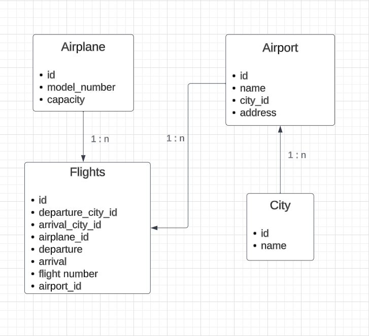

# TravelAero's FlightsAndSearch Service 

## Project Setup:

- Go to `flightsAndSearch/src` and execute `npm install`
- Create a `.env` file in the `flightsAndSearch` directory based on file `.envExample` 
- Create a new  file `config.json` inside `src/config` folder with following json
 
```

{
  "development": {
    "username": <MYSQL_LOGIN_USERNAME>,
    "password": <PASSWORD>,
    "database": "FlightsAndSearch_DB_DEV",
    "host": "127.0.0.1",
    "dialect": "mysql"
  }
}

```
* Go to `flightsAndSearch/src` and execute 
  * `npx sequelize db:create`
  * `npx sequelize model:generate --name City --attributes name:String`(To create model,just an FYI,skip this)
  * `npx sequelize db:migrate`
  * `npx sequelize model:generate --name Airport --attributes cityId:integer,name:string,address:string`(Skip, again an FYI)
  * `npx sequelize db:seed:all`

- Go to `flightsAndSearch` and start the server by `npm start`

<br>

## DB Design

